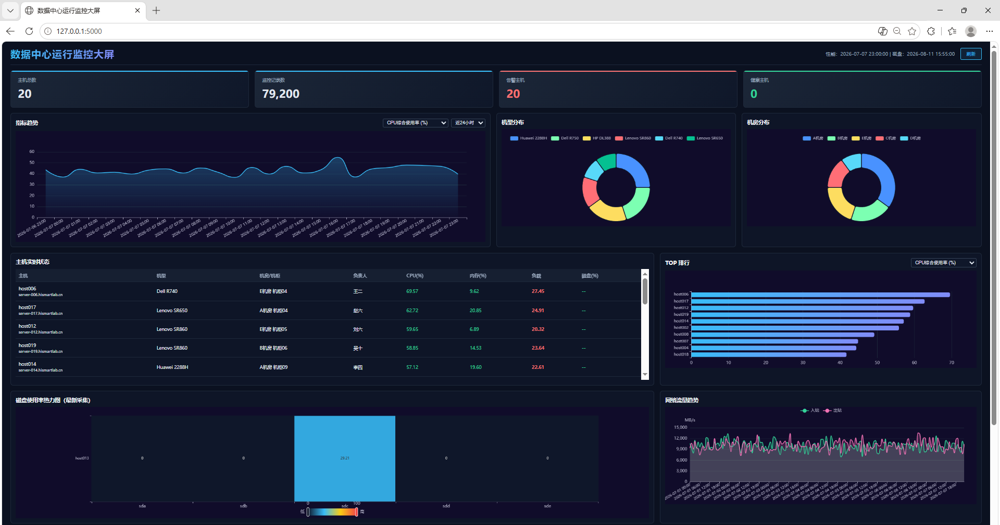
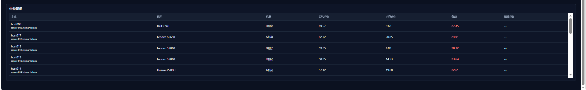

# 数据中心运行监控大屏

基于 `data/` 目录下的 4 张监控数据表，完成数据清洗、MySQL 入库，并提供 PC 端可视化大屏。

## 数据说明

| 文件名 | 说明 | 行数 |
| --- | --- | --- |
| `host_detail.dat` | 主机档案表（20 台主机） | 20 |
| `mod_detail.dat` | 指标字典表（55 种监控指标） | 55 |
| `disk_tsar.dat` | 磁盘采集流水（每 5 分钟） | 1.2 万 |
| `pref_tsar.dat` | 性能采集流水（每 1 小时） | 6.7 万 |

## 技术栈

- 后端：Python + Flask + PyMySQL
- 前端：HTML5 + CSS3 + ECharts 5
- 数据库：MySQL 8（Docker 已部署）

## 安装依赖

```bash
pip install -r requirements.txt
```

> 已安装：`Flask`、`PyMySQL`。

## 数据入库

确认 Docker MySQL 已启动（容器名 `mysql8`，端口 `3306`，root 密码 `123456`）：

```bash
python etl.py
```

脚本会自动创建 `datacenter` 数据库和 4 张表，并导入数据。

## 启动大屏服务

```bash
python app.py
```

服务默认运行在 `http://127.0.0.1:5000/`，在浏览器中打开即可查看大屏。

## 大屏功能

- 顶部 KPI：主机总数、监控记录数、告警/健康主机数、最新采集时间
- 指标趋势：支持选择 20 种性能指标及时段（全部 / 24h / 3天 / 7天）
- 机型 / 机房分布饼图
- 主机实时状态表（CPU、内存、负载、磁盘利用率）
- TOP 排行（支持各指标及磁盘最大利用率）
- 磁盘使用率热力图（20 主机 × 5 块盘）
- 网络入/出站流量趋势
- 告警明细（CPU>80%、内存>85%、负载>5、磁盘>90%、CPU等待>30%）
- 每 30 秒自动刷新

## 效果预览

**上半部分** — KPI、指标趋势、分布饼图、主机状态



**下半部分** — TOP 排行、磁盘热力图、网络流量、告警明细



## 项目结构

```
DataCenterPanorama/
├── app.py                 # Flask 后端与 API
├── config.py              # 数据库与数据目录配置
├── etl.py                 # 数据清洗与 MySQL 入库
├── requirements.txt
├── README.md
├── templates/
│   └── index.html         # 大屏页面
├── static/
│   ├── css/style.css      # 深色科技风样式
│   └── js/dashboard.js    # ECharts 图表渲染
├── screenshot/
│   ├── photo1.png          # 上半部分截图
│   └── photo2.png          # 下半部分截图
└── data/
    ├── host_detail.dat
    ├── mod_detail.dat
    ├── disk_tsar.dat
    └── pref_tsar.dat
```

## 默认配置

```python
DB_CONFIG = {
    'host': '127.0.0.1',
    'port': 3306,
    'user': 'root',
    'password': '123456',
    'database': 'datacenter'
}
```

如 MySQL 连接信息不同，请修改 `config.py`。
